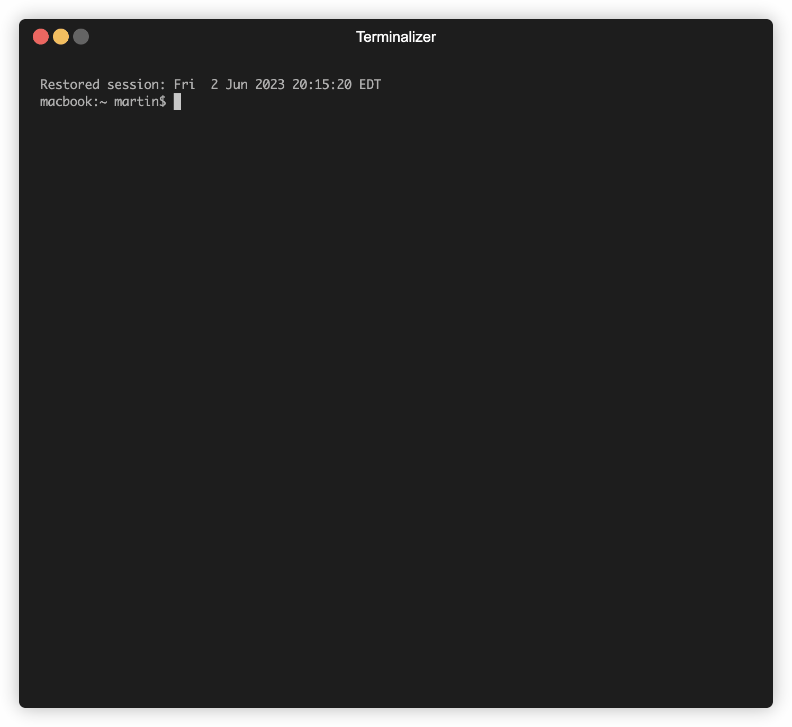

# aws-sso-credentials
## About
*aws-sso-credentials* - A simple Python tool to simplify getting short-term credential tokens for CLI/Boto3 operations when using AWS SSO. Uses standard AWS CLI configuration files and allows easy swapping between roles/accounts.

## Motivation
When using AWS CLI/Boto3 based tools with AWS, while using several have several accounts/roles, switching between accounts/roles, grabing temporary session credentials can take multiple steps. To make this easy, this tool makes the process easy

## How it works
This script piggy-backs on the new AWS CLI tool to read the SSO credentials cache and then makes Boto3 calls to retrieve the temporary credentials for the relevant account/role you want.

It uses the standard AWS CLI configuration files, can trigger a SSO login session if needed and gives you an interactive command line interface to switch between the role and account you want. It will can also copy your chosen profile/credentials into the default profile for times where don't want/can't tell your application to use a specific profile.

## Prerequisites
The script is written in Python 3 and requires a working installation of [AWS CLI v2](https://docs.aws.amazon.com/cli/latest/userguide/install-cliv2.html).

The scripts dependencies are defined in the `requirements.txt` file. You can install these with:

```bash
  pip install -r requirements.txt
```

## Setting up
1. Validate that you have all the profiles configured in your `~/.aws/config` file 

2. Run the AWS CLI tool *at least once* using one of the profiles you created so that the SSO cache is created.

```bash
  aws sso login --profile dev-env
```

3. Copy the `awssso` script to somewhere you can run it. Usually somewhere on your `%PATH%` or make a symlink to it from somewhere like `/usr/local/bin`. Make sure to make it executable, i.e. `chmod ug+x awssso`.

That's it. You should be good to go. Launch `awssso` and start typing your profile name.

## Usage

You can run `awssso` passing it the name of the profile you want credentials for.

```bash
  $ awssso dev-env
```

If you don't pass a profile name it will allow you to select from a list:

```
   $ awssso
   
   [?] Please select an AWS config profile: dev-env
   default
 > dev-env
   prod-env
```


Once the profile is selected, the script will check if you're current SSO credentials are valid and warn you if they will expire soon. It will then use these credentials to get the short term-credentials and copy them to your `.aws/credentials` file.

By default, the selected profile gets the credentials also copied into the `default` profile 

### Options

- `-h, --help` - Show help and a list of command line options.
- `-v, --verbose` Verbose mode. Tells you what the script is doing and dumps information about when your SSO credentials and temporary credentials expire.
- `--login` Invokes the AWS CLI to perform a SSO login and refresh SSO credentials.
- `--docker` Use the Docker version of the AWS CLI
- `-nd, --not-use-default` Avoids copying the chosen profile and credentials to the default profile.

